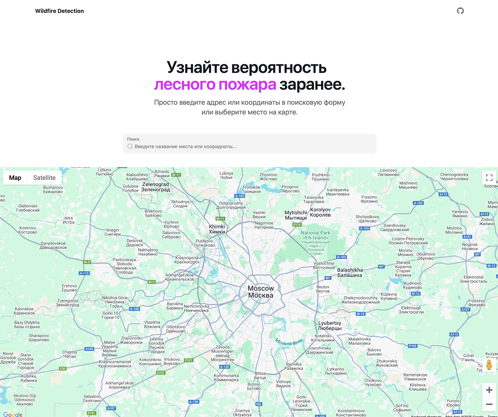
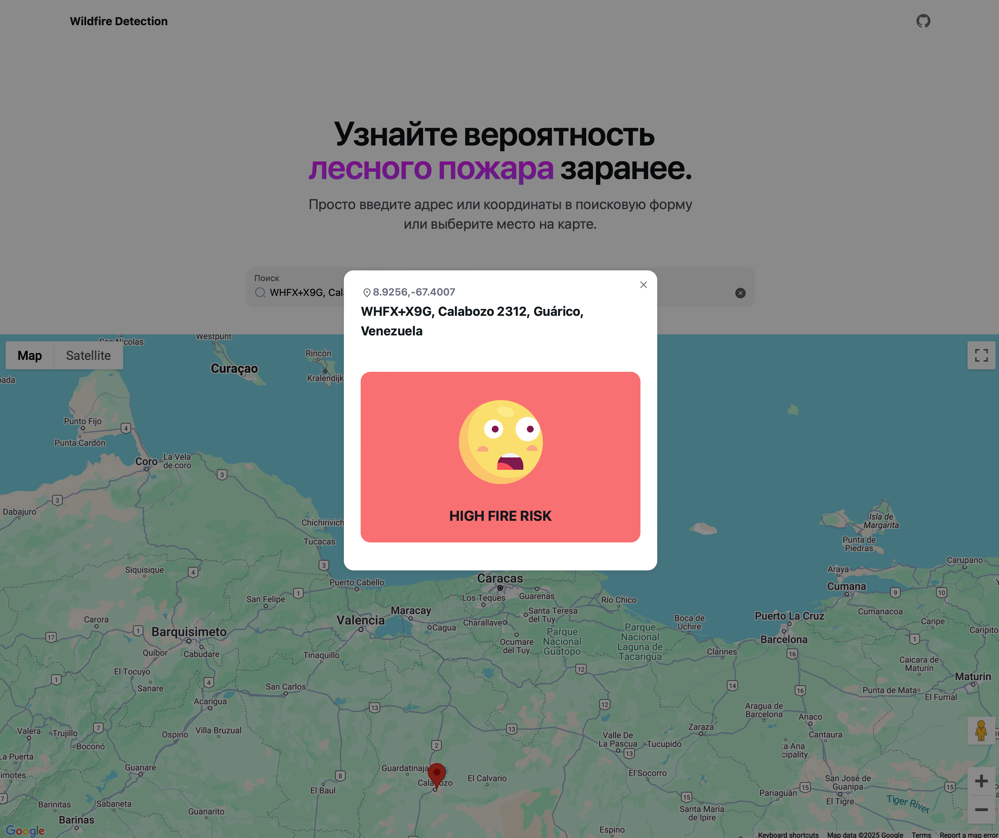

# 🔥 Мониторинг экосистем через IT-решения 🌳
##  

## Содержание 📚

1. [Background on Wildfires 🌍](#background-on-wildfires-)
2. [Project Overview 🚀](#project-overview-)
3. [Features 🌟](#features-)
4. [Screenshot 📸](#screenshot-)
5. [Installation 🛠️](#installation-%EF%B8%8F)
6. [Usage 💻](#usage-)
7. [File Structure 📁](#file-structure-)
8. [Requirements 📦](#requirements-)
9. [Improvements ✨](#improvements-)
10. [Contributing 🤝](#contributing-)
11. [License 📜](#license-)

## Лесные пожары: угроза экологии и экономике 🌍
Лесные пожары – одна из самых серьезных природных угроз. Они наносят колоссальный ущерб экологии, экономике и жизни людей. 
Из-за изменения климата частота и сила пожаров только растут.

### 📌 Ключевые факты:
🔥 **Масштаб ущерба**: В 2021 году в России от лесных пожаров погибло 5,01 млн гектаров лесов. 
[[Источник]](https://earthtouches.me/news/2023/11/10/jeksperty-rasskazali-skolko-lesov-pogiblo-v-rossii-ot-pozharov-za-10-let)

🔥 **Частота**: Ежегодно в России регистрируется от 9 тыс. до 35 тыс. лесных пожаров, охватывающих площади от 500 тыс. 
до нескольких миллионов гектаров. [[Источник](https://tass.ru/info/14586659)]

🔥 **Экономический ущерб**: Среднегодовой ущерб от лесных пожаров в России составляет около 20 млрд рублей, 
из которых от 3 до 7 млрд — потери лесного хозяйства. [[Источник](https://tass.ru/info/14586659)]

🔥 Изменение климата: Повышение глобальных температур и более засушливые условия значительно увеличивают риск и тяжесть лесных пожаров. 
[[Источник](https://tass.ru/info/14586659)]

Эти тревожные данные подчеркивают необходимость эффективных систем обнаружения и мониторинга лесных пожаров. 
Современные технологии раннего обнаружения и оповещения могут спасти жизни и снизить ущерб.

## Обзор проекта 🚀
Мы разработали систему, которая прогнозирует риск лесных пожаров на основе метеорологических данных. 
Используя методы машинного обучения, наша система точно предсказывает вероятность возникновения пожаров и своевременно 
оповещает пользователей через удобное веб-приложение.

**Наша модель** на основе погодных данных анализирует метеорологические показатели для оценки риска лесных пожаров. 
Точность модели достигает 97–100%.

Применение таких технологий в России особенно актуально, учитывая масштабность лесных массивов и частоту пожаров. 
Своевременные прогнозы и оповещения помогут оперативно реагировать на угрозы, снижая ущерб для экологии и экономики.

## Функционал
- **Выбор локации на карте**: Функционал поиска геоточки на карте для получения погодных данных и предсказания риска пожара.
- **Предсказания риска**: Предсказывает риск лесного пожара на основе текущих погодных условиях по локации.
- **Подписка на алерты**: Подписка на e-mail уведомления о повышенном риске пожара по выбранной локации.

## Демонстрационная версия 👀
|  |   |
|----------------------------|-----------------------------------------|

### Посмотреть вживую на [wildfire-detection.artzaitsev.com →](https://wildfire-detection.artzaitsev.com)

## Локальная сборка и разработка 🛠️

1. **Clone**:
   ```bash
   git clone git@github.com:artzaitsev/wildfire-detection.git
   cd wildfire-detection
   ```

2. **Инициализация virtual env**:
   ```bash
   python3 -m venv venv
   source venv/bin/activate  # On Windows use `venv\Scripts\activate`
   ```

3. **Установка зависимостей**:
   ```bash
   pip install -r requirements.txt
   ```

   Убедитесь, что запустили Jupyter Notebook для обучения модели:
      - Откройте `modeling/modeling_catboost_external.ipynb` в Jupiter для работы с моделью. Это актуальная модель, остальные - экспериментальные 

4. **Установите переменные окружения**:
   Добавьте `.env` файл и укажите следующие переменные:
   ```bash
   POSTGRES=your_pg_conntection_string
   ```

5. **Запустите deveopment окружение через Docker compose**:
   ```bash
   docker compose up
   ```
